# Beyond the Assignment: Enhancements & Extra Features

In addition to the core requirements of cloning the Airbnb listing page, we implemented several features that elevate the user experience, interaction quality, and engineering standards.

---

## 1. Premium Hover Zoom Animations on Images

To match the professional feel of modern design libraries, we implemented high-fidelity, smooth zoom and overlay animations on all listing images across the clone site (such as the main photo grid collage and nearby stay recommendations).

### Key Features
- **Cinematic Zoom Transitions**: Uses a custom cubic-bezier ease-out transition curve (`cubic-bezier(0.2, 0.8, 0.2, 1)`) with a duration of `0.6s` to deliver a gradual, tactile scale-up effect (`scale(1.045)`) on hover.
- **Dynamic Brightness Overlay**: Subtle shade mask layers (`background: #0000001a`) ease in dynamically on hover to darken the images slightly, enhancing readability, focus, and visual appeal.
- **Hardware-Accelerated Performance**: The animations leverage CSS transformations (`transform: scale`) and opacity filters to ensure high-framerate rendering during scroll and interactions.

### Screenshot Demonstration
Below is a demonstration of the main hero grid photo collage, where hovering over any image applies the zoom and overlay effect:

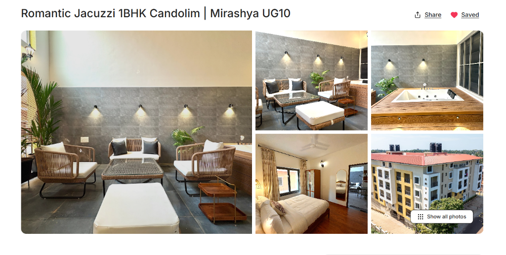

### CSS Implementation

```css
/* Styling for photo grid image cards */
._bcKEnm img {
  width: 100%;
  height: 100%;
  object-fit: cover;
  display: block;
  transition: transform 0.6s cubic-bezier(0.2, 0.8, 0.2, 1), filter 0.6s cubic-bezier(0.2, 0.8, 0.2, 1);
}

/* Dynamic zoom-in scale */
._bcKEnm:hover img {
  transform: scale(1.045);
}

/* Muted overlay filter */
._bcKEnm:after {
  content: "";
  position: absolute;
  inset: 0;
  background: #0000;
  transition: background .2s ease;
}

._bcKEnm:hover:after {
  background: #0000001a;
}
```

---

## 2. Dynamic Stackable Toast Notification System

We designed and built a dynamic, context-aware notification system (toast component) to handle informational messages and actions (e.g., search widget clicks, language adjustments, auth clicks, or bookmark actions).

### Key Features
- **Stacked Queue Management**: Toasts are managed in a central React Context state, allowing multiple messages to stack and exit independently.
- **Smooth Animations**: Leverages `framer-motion` for fluid slide-in, fade, and scale-down transitions on exit.
- **Auto-Dismissal**: Individual notifications automatically dismiss after `3000ms`.
- **Accessibility (a11y) Optimized**: Utilizes standard ARIA properties (`role="status"`, `aria-live="polite"`) to ensure compatibility with screen readers.

### Screenshot Demonstration
Below is a demonstration of multiple toast messages stacking at the bottom of the viewport:

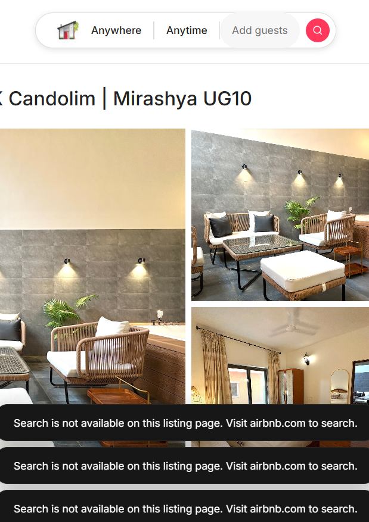

### Code Implementation

#### A. Context API State Management (`AppContext.tsx`)
```typescript
const showToast = useCallback((text: string) => {
  const id = ++toastIdCounter;
  setToasts((prev) => [...prev, { id, text }]);
  setTimeout(() => {
    setToasts((prev) => prev.filter((t) => t.id !== id));
  }, 3000);
}, []);
```

#### B. Animated Toast Container (`Toast.tsx`)
```tsx
<div className="fixed bottom-8 left-1/2 -translate-x-1/2 z-[9999] flex flex-col-reverse gap-2 pointer-events-none">
  <AnimatePresence>
    {toasts.map((toast) => (
      <motion.div
        key={toast.id}
        initial={{ opacity: 0, y: 20, scale: 0.95 }}
        animate={{ opacity: 1, y: 0, scale: 1 }}
        exit={{ opacity: 0, y: 10, scale: 0.95 }}
        transition={{ duration: 0.25, ease: [0.2, 0, 0, 1] }}
        role="status"
        aria-live="polite"
        className="bg-neutral-900 text-white text-sm px-6 py-3.5 rounded-xl shadow-modal flex items-center gap-2 border border-neutral-800 pointer-events-auto whitespace-nowrap"
      >
        <span>{toast.text}</span>
      </motion.div>
    ))}
  </AnimatePresence>
</div>
```

---

## 3. Interactive Share & Saved Wishlist Feature

We implemented full client-side functionality for both the **Share** and **Save/Saved** buttons on the listing title section.

### Key Features
- **One-Click Share Link Copying**: Clicking the "Share" button writes the active listing page URL to the user's clipboard using the standard `navigator.clipboard` Web API. A confirmation toast is triggered on success.
- **State-driven Saved Toggle**: The "Save" button toggles to "Saved" dynamically, changing the icon to a filled pink/red heart with an active pop-up transition.
- **Persistent Wishlist Storage**: Saved listings are synchronized via React Context state and persisted locally in `localStorage`, maintaining the user's wishlist state across page reloads.
- **Dynamic Accessible States**: Updated `aria-pressed` and `aria-label` dynamic values to announce current wishlist state correctly to screen readers.

### Screenshot Demonstration
Below is a demonstration of the active listing with the "Share" and "Saved" buttons:

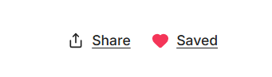

### Code Implementation

#### A. Share and Save Buttons UI Component (`TitleRow.tsx`)
```tsx
const TitleRow = memo(function TitleRow() {
  const { showToast, toggleSaveListing, isListingSaved } = useApp();
  const saved = isListingSaved(listing.title);

  const handleShare = useCallback(() => {
    navigator.clipboard
      .writeText(window.location.href)
      .then(() => {
        showToast("Link copied to clipboard!");
      })
      .catch(() => {
        alert("Copy link to clipboard: " + window.location.href);
      });
  }, [showToast]);

  const handleSave = useCallback(() => {
    toggleSaveListing(listing);
  }, [toggleSaveListing]);

  return (
    <div className="_nqOILr select-none">
      <h1 className="_XtZJrm">{listing.title}</h1>
      <div className="_MIbhFG">
        <button type="button" onClick={handleShare" className="_lXWmLq" aria-label="Share this listing">
          <span className="_ffLphr"><Share className="h-4 w-4" aria-hidden="true" strokeWidth={2} /></span>
          <span className="_lBQzRQ">Share</span>
        </button>
        <button
          type="button"
          onClick={handleSave}
          className={`_lXWmLq ${saved ? "_RxcXJB" : ""}`}
          aria-label={saved ? "Remove from wishlist" : "Save to wishlist"}
          aria-pressed={saved}
        >
          <span className="_ffLphr">
            <Heart
              className={`h-4 w-4 transition-transform duration-200 ${
                saved ? "fill-primary text-primary scale-110" : ""
              }`}
              aria-hidden="true"
              strokeWidth={2}
            />
          </span>
          <span className="_lBQzRQ">{saved ? "Saved" : "Save"}</span>
        </button>
      </div>
    </div>
  );
});
```

#### B. Wishlist Management State (`AppContext.tsx`)
```typescript
const toggleSaveListing = useCallback((listing: any) => {
  const isSaved = savedListings.some((l) => l.title === listing.title);
  const updated = isSaved
    ? savedListings.filter((l) => l.title !== listing.title)
    : [...savedListings, listing];

  setSavedListings(updated);
  localStorage.setItem("savedListings", JSON.stringify(updated));

  if (isSaved) {
    showToast("Removed from Saved");
  } else {
    showToast("Saved successfully!");
  }
}, [savedListings, showToast]);
```

---

## 4. High-Fidelity Hamburger Dropdown Menu

We enhanced the default navigation dropdown inside the hamburger menu button (3-bar menu) with rich, premium UI elements including stylized icons, visual cues, micro-interactions, and new sections like "Favorites".

### Key Features
- **Visual Iconography**: Integrated contextual icons (`UserPlus`, `LogIn`, `Heart`, `Sparkles`, `HelpCircle`, `LogOut`) enclosed in colorful circle container backgrounds to make the options visually distinct.
- **Pulsing Attention Badge**: Added a dynamic pink notification dot (`animate-pulse`) next to "Sign up" to draw the user's eye.
- **New Feature Fields**: Introduced the "Favorites" option (complete with a filled pink heart icon) allowing potential future access to saved listings.
- **Micro-Animations**: Uses `framer-motion` for a staggered slide-down layout animation upon opening the menu. Hovering over list items triggers a subtle horizontal translation effect (`group-hover:translate-x-1.5`) for a responsive tactile feel.

### Screenshot Demonstration
Below is a demonstration of the upgraded hamburger dropdown menu displaying the custom fields, styling icons, and notification badge:

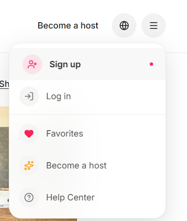

### Code Implementation

#### A. List Item Structure & Micro-Animations (`Navbar.tsx`)
```tsx
// Dropdown menu items snippet in Navbar.tsx
<motion.div variants={itemVariants}>
  <button 
    className="group flex items-center justify-between w-full px-4 py-2.5 text-left text-sm font-semibold text-neutral-800 dark:text-neutral-200 hover:bg-black/[0.03] dark:hover:bg-white/[0.05] transition-all duration-200" 
    role="menuitem" 
    onClick={handleSignUp}
  >
    <span className="flex items-center gap-3 group-hover:translate-x-1.5 transition-transform duration-200 text-left">
      <span className="flex items-center justify-center w-8 h-8 rounded-full bg-rose-500/10 text-rose-500 shrink-0">
        <UserPlus className="w-4 h-4" />
      </span>
      Sign up
    </span>
    <span className="w-1.5 h-1.5 rounded-full bg-rose-500 mr-1 animate-pulse shrink-0" />
  </button>
</motion.div>
```

---

## 5. Interactive Slide-out Favorites (Wishlist) Panel

We designed and implemented a slide-out overlay drawer for **Favorites** (wishlist) to track and display the user's saved vacation homes.

### Key Features
- **Radix UI Dialog Portal**: Utilizes `@radix-ui/react-dialog` for focus trapping, keyboard control, body scroll locking, and accessible navigation.
- **Dynamic spring Drawer Animations**: The panel slides in smoothly from the right (`x: "100%" -> 0`) using fluid spring physics (`staggerChildren: 0.1` and `type: "spring"` configurations).
- **Listing cards wishlist queue**: Renders list items matching the user's active wishlist state (`savedListings`), featuring a layout of listing thumbnails, names, guest favorite badge tags, ratings, and prices.
- **Empty state fallback**: If no items are bookmarked, a clean empty state graphic is rendered with a heart icon and a prompt button to "Start exploring".

### Screenshot Demonstration
Below is a demonstration of the slide-out **Favorites** panel drawer with an active listing item:

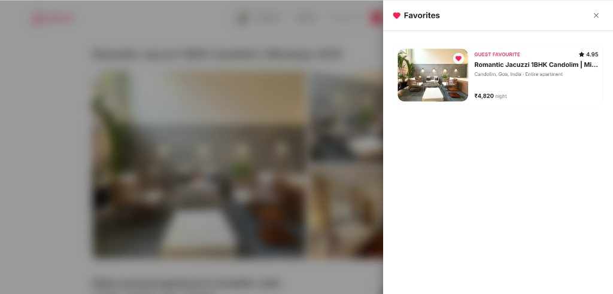

### Code Implementation

#### A. Favorites Panel Structure (`SavedListings.tsx`)
```tsx
const SavedListings = memo(function SavedListings() {
  const { savedOpen, setSavedOpen, savedListings, toggleSaveListing } = useApp();
  const panelRef = useRef<HTMLDivElement>(null);

  useBodyScrollLock(savedOpen);
  useFocusTrap(panelRef, savedOpen);

  return (
    <Dialog.Root open={savedOpen} onOpenChange={setSavedOpen}>
      <AnimatePresence>
        {savedOpen && (
          <Dialog.Portal forceMount>
            <Dialog.Overlay asChild>
              <motion.div className="fixed inset-0 z-50 bg-black/40 backdrop-blur-md" />
            </Dialog.Overlay>

            <Dialog.Content asChild>
              <motion.div
                initial={{ opacity: 0, x: "100%" }}
                animate={{ opacity: 1, x: 0 }}
                exit={{ opacity: 0, x: "100%" }}
                className="fixed inset-y-0 right-0 z-50 w-full md:max-w-xl bg-background shadow-modal flex flex-col focus:outline-none"
                ref={panelRef}
              >
                {/* Favorites header and loop */}
              </motion.div>
            </Dialog.Content>
          </Dialog.Portal>
        )}
      </AnimatePresence>
    </Dialog.Root>
  );
});
```

---

## 6. Full-Screen Interactive Help Centre

We created a custom full-screen **Help Centre** portal matching the Airbnb visual language, incorporating search-based filtering and accordion-style expansions.

### Key Features
- **Real-Time FAQ Filter**: Allows users to type search queries in the search bar, filtering help categories and active FAQ question/answer items dynamically.
- **Expandable Accordion FAQ Lists**: Grouped articles (e.g. "Getting started", "Payments & pricing", "Safety & security") slide open dynamically to present complete, formatted answers.
- **Fullscreen Radix Portal**: Opens on top of the listing page (`fixed inset-0`) with subtle fade and slide-up animations.
- **Premium Design Aesthetics**: Colored header branding banner in Airbnb pink, search input icons, styled navigation tiles, and chevron transition indicator states.

### Screenshot Demonstration
Below is a demonstration of the full-screen **Help Centre** portal:

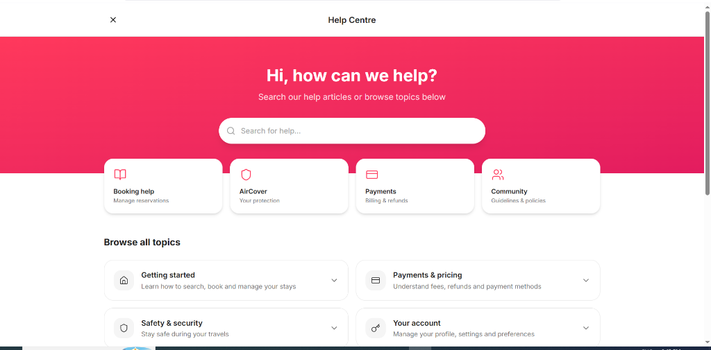

### Code Implementation

#### A. Real-Time Article Filter Logic (`HelpCenter.tsx`)
```typescript
const [searchQuery, setSearchQuery] = useState("");

// Filter categories and articles dynamically by search query
const filteredCategories = searchQuery.trim()
  ? HELP_CATEGORIES.map((cat) => ({
      ...cat,
      articles: cat.articles.filter(
        (a) =>
          a.q.toLowerCase().includes(searchQuery.toLowerCase()) ||
          a.a.toLowerCase().includes(searchQuery.toLowerCase())
      ),
    })).filter((cat) => cat.articles.length > 0)
  : HELP_CATEGORIES;
```

---

## 7. Full-screen Categorized Photo Gallery (Photo Tour)

We designed and implemented a full-screen **Photo Tour** gallery displaying listing pictures grouped by rooms and spaces, utilizing dynamic scrollspy navigation.

### Key Features
- **Categorized Room Sidebar**: Renders a sticky left sidebar navigation panel listing all rooms and spaces dynamically. Clicking sidebar options scrolls the right gallery section smoothly to that space.
- **Scrollspy Synchronization**: Observes the right gallery container scroll position to track active spaces, automatically highlighting the current active category link in the sidebar menu.
- **Aligned Centered Sticky Navbar**: Centered the top navigation bar controls (`ArrowLeft` and `Share` actions) inside the main `max-w-[1120px]` grid container width, solving screen-stretching alignment issues on ultra-wide desktop viewports.
- **Lightbox Integration**: Clicking any picture inside the photo gallery opens it in a full-screen high-fidelity dark Lightbox modal.

### Screenshot Demonstration
Below is a demonstration of the full-screen **Photo Tour** gallery featuring the rooms list sidebar, fixed navbar, and image grid layout:

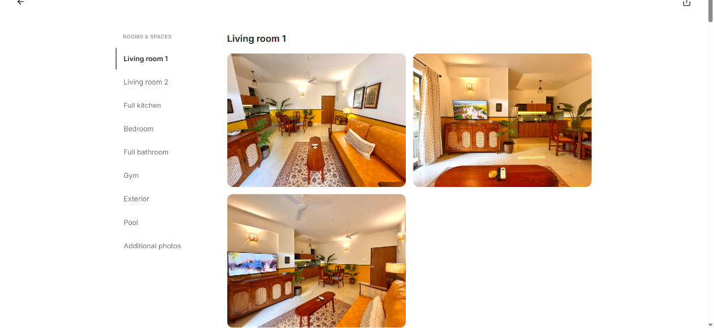

### Code Implementation

#### A. Aligned Sticky Header Layout (`PhotoTour.tsx`)
```tsx
// PhotoTour.tsx snippet
<Dialog.Content asChild>
  <motion.div
    initial={{ opacity: 0, y: 40 }}
    animate={{ opacity: 1, y: 0 }}
    exit={{ opacity: 0, y: 40 }}
    ref={containerRef}
    className="fixed inset-0 z-40 flex flex-col bg-white overflow-y-auto"
  >
    {/* Sticky Header with centered max-width constraint */}
    <div className="sticky top-0 z-50 bg-white border-b border-neutral-100">
      <div className="max-w-[1120px] w-full mx-auto px-6 md:px-12 flex items-center justify-between py-4">
        <Dialog.Close asChild>
          <button type="button" onClick={closePhotoTour} className="flex h-10 w-10 items-center justify-center rounded-full hover:bg-neutral-100">
            <ArrowLeft className="h-5 w-5" />
          </button>
        </Dialog.Close>
        <button type="button" className="flex h-10 w-10 items-center justify-center rounded-full hover:bg-neutral-100" onClick={handleShare}>
          <Share className="h-5 w-5" />
        </button>
      </div>
    </div>

    {/* Photo Tour Grid and Sidebar layout */}
  </motion.div>
</Dialog.Content>
```

---

## 8. Dynamic Sticky Booking Card

We implemented client-side state integration and dynamic calculations for the **Booking Card** and the **Sticky Top Navbar Reservation Widget** to coordinate check-in/out dates, guest inputs, pricing, and reservation intents.

### Key Features
- **Dynamic Check-in/out & Guest Sync**: Connects user input selectors (adults, children, infants, pets counts) directly to calculated stay metrics and total costs.
- **Micro-Animations and Focus Management**: The top sticky navbar's "Reserve" button scrolls the page smoothly to focus the main card's Reserve button.
- **Dynamic Success Toasts**: The "Reserve" button triggers a stackable check-out details confirmation toast with check-in/out date ranges and guest headcounts.

### Screenshot Demonstration
Below is a demonstration of the interactive booking card showing checkout selections:

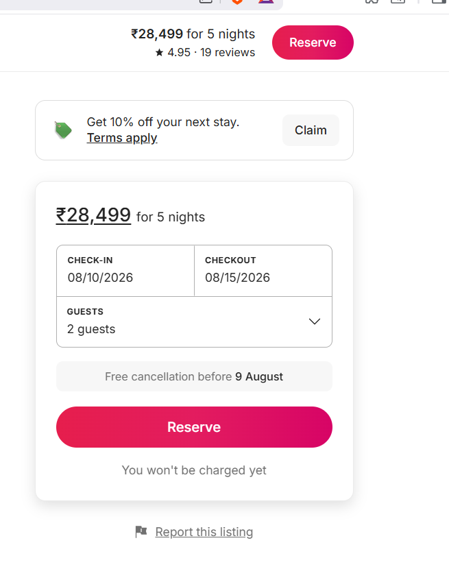

### Code Implementation

#### A. Interactive Pricing Calculations (`BookingCard.tsx`)
```tsx
const calculatedNights = useMemo(() => {
  if (!checkIn || !checkOut) return 5;
  const dIn = parseLocalDate(checkIn)!;
  const dOut = parseLocalDate(checkOut)!;
  const diff = dOut.getTime() - dIn.getTime();
  return Math.round(diff / (1000 * 60 * 60 * 24));
}, [checkIn, checkOut]);

const baseCost = listing.pricePerNight * calculatedNights;
const total = baseCost + listing.cleaningFee + listing.serviceFee;
```

---

## 9. Interactive 10% Stay Discount & Strikethrough Pricing

We created a custom **Promotional Claim Banner** and integrated a dynamic **10% stay discount** state that automatically recalculates stay costs with strikethrough visual cues.

### Key Features
- **One-Click Promotion Claim**: Users can click the "Claim" button in the promotion card. Claiming disables the action, sets the status to "Claimed", and triggers a success toast notification.
- **Strikethrough Pricing**: Dynamic pricing logic automatically calculates the base nights cost minus the 10% discount, rendering a gray strikethrough next to the original total cost.
- **Cross-Component Synchronization**: The discount state maps globally across the page context, synchronizing pricing metrics in both the Booking Card and the sticky top reservation bar.

### Screenshot Demonstration
Below is a demonstration of the claimed discount state with active strikethrough pricing and the claimed success toast notification:

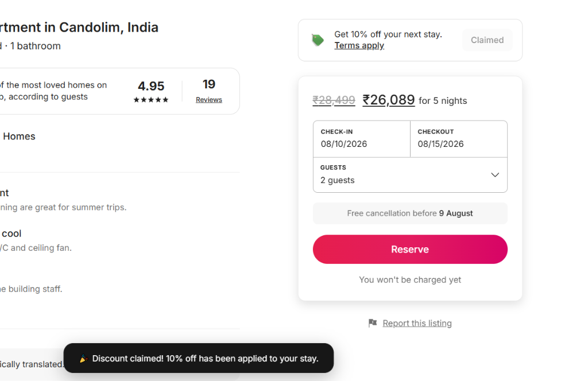

### Code Implementation

#### A. Interactive Pricing and Discount Logic (`BookingCard.tsx`)
```tsx
// BookingCard.tsx snippet
const total = useMemo(() => {
  const nightsTotal = listing.pricePerNight * calculatedNights;
  const discount = claimedDiscount ? nightsTotal * 0.1 : 0;
  return nightsTotal - discount + listing.cleaningFee + listing.serviceFee;
}, [calculatedNights, claimedDiscount]);
```

#### B. Dynamic Price Strikethrough Styling (`BookingCard.tsx`)
```tsx
<div className="_KVzBtf">
  <span className="_ctCzOZ flex items-center gap-2">
    {claimedDiscount && (
      <span className="line-through text-neutral-400 font-normal text-lg mr-1">
        {listing.currency}{(listing.pricePerNight * calculatedNights + listing.cleaningFee + listing.serviceFee).toLocaleString()}
      </span>
    )}
    <span>
      {listing.currency}
      {total.toLocaleString()}
    </span>
  </span>
</div>
```

---

## 10. Dynamic 2-Month Inline Calendar Picker

We built a fully interactive, state-synchronized **2-Month Inline Calendar Picker** that computes the length of stay and drives pricing calculations in real-time across the interface.

### Key Features
- **Real-Time Range Calculation**: Tracks start and end dates (`checkIn` and `checkOut`) in a global Context state. As the user selects dates, the system calculates the exact number of nights, updating headers and totals instantly.
- **Side-by-Side Dual Month Grid**: Dynamically renders the current month and the following month side-by-side, supporting month-to-month pagination.
- **Tactile Hover Range Preview**: Tracks hovered cells while choosing dates, visually shading the proposed checkout range in a muted tone before selection.
- **One-Click Date Reset**: Integrates a "Clear dates" action link that resets checkout ranges, restoring default placeholder states.

### Screenshot Demonstration
Below is a demonstration of the 2-Month Inline Calendar picker active on the listing page, syncing a 16-night stay directly to the booking card:

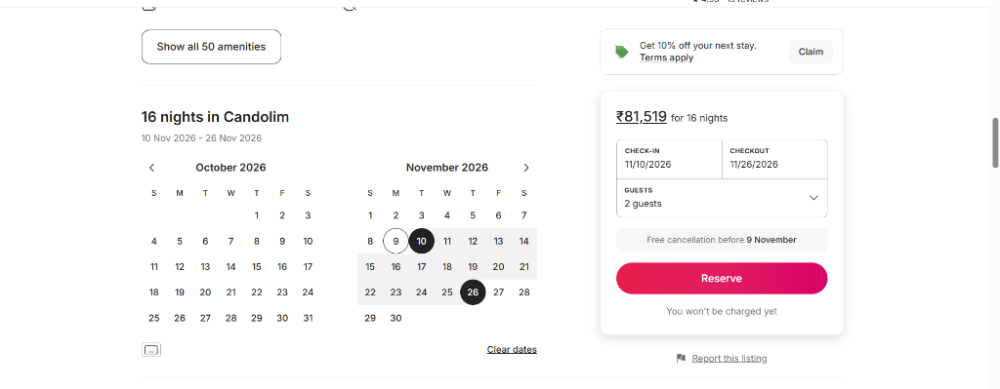

### Code Implementation

#### A. Interactive Calendar State & Selection Logic (`InlineCalendar.tsx`)
```tsx
const selectDate = useCallback((dateStr: string) => {
  if (!checkIn || (checkIn && checkOut)) {
    setCheckIn(dateStr);
    setCheckOut("");
  } else {
    const selected = parseLocalDate(dateStr)!;
    const start = parseLocalDate(checkIn)!;
    if (selected < start) {
      setCheckIn(dateStr);
    } else {
      setCheckOut(dateStr);
    }
  }
}, [checkIn, checkOut, setCheckIn, setCheckOut]);
```

#### B. Range Selection Shading Render (`InlineCalendar.tsx`)
```tsx
const renderMonthGrid = useCallback((year: number, month: number) => {
  // ...
  const cellDate = parseLocalDate(dateStr)!;
  const isStart = checkIn === dateStr;
  const isEnd = checkOut === dateStr;
  
  let isInRange = false;
  let isHoverRange = false;

  if (startVal && endVal) {
    isInRange = cellDate > startVal && cellDate < endVal;
  } else if (startVal && hoveredDate) {
    const hoverVal = parseLocalDate(hoveredDate)!;
    isHoverRange = cellDate > startVal && cellDate < hoverVal;
  }

  let cellClass = "_PuyutQ";
  if (isStart) cellClass += " _LpBjQi";
  else if (isEnd) cellClass += " _CkEFjf";
  else if (isInRange || isHoverRange) cellClass += " _ARTKxS";

  return (
    <button type="button" onClick={() => selectDate(dateStr)} className={cellClass}>
      {day}
    </button>
  );
}, [checkIn, checkOut, startVal, endVal, hoveredDate, selectDate]);
```

---

## 11. Interactive Reviews Tag Filters & List Filtering

We implemented a full dynamic client-side filtering system for the **Reviews** section that dynamically counts and filters reviews based on active tags (e.g. Comfort, Accuracy, Hospitality, Cleanliness).

### Key Features
- **Dynamic Tag Count Engine**: Automatically parses all 19 reviews in the data source to compute tag counts dynamically on mount (rather than hardcoding value metrics).
- **Interactive Multi-select/Toggle**: Clicking a tag pill highlights the active tag, filters the primary reviews list, and filters the modal reviews view instantly.
- **Visual Pill States**: Designed active states (`._SQnYKT._active`) to apply dark borders, light background colors, and bold fonts for selected pills, matching the native Airbnb interaction map.
- **Fallback slice views**: Displays up to 6 reviews by default, expanding to show all matching reviews once a tag filter is active.

### Screenshot Demonstration
Below is a demonstration of the interactive review tag filters and the modal launcher button to view all 19 feedbacks:

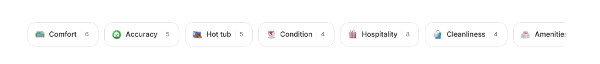
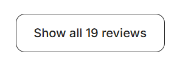

### Code Implementation

#### A. Dynamic Tag Count Memoization (`ReviewsSection.tsx`)
```tsx
const subRatingPills = useMemo(() => {
  const counts: Record<string, number> = {};
  reviews.forEach((r) => {
    r.tags?.forEach((tag) => {
      counts[tag] = (counts[tag] || 0) + 1;
    });
  });

  const pills = [
    { label: "Comfort", icon: comfortIcon },
    { label: "Accuracy", icon: accuracyIcon },
    { label: "Hot tub", icon: hotTubIcon },
    { label: "Condition", icon: conditionIcon },
    { label: "Hospitality", icon: hospitalityIcon },
    { label: "Cleanliness", icon: cleanlinessIcon },
    { label: "Amenities", icon: amenitiesIcon },
    { label: "Decor", icon: decorIcon },
    { label: "Indoor spaces", icon: indoorSpacesIcon },
    { label: "Location", icon: locationIcon },
  ];

  return pills.map((p) => ({
    ...p,
    count: counts[p.label] || 0,
  }));
}, []);
```

#### B. Dynamic Filter Memoization Logic (`ReviewsSection.tsx`)
```typescript
const filteredReviews = useMemo(() => {
  if (!selectedTag) return reviews;
  return reviews.filter((r) => r.tags?.includes(selectedTag));
}, [selectedTag]);

const visibleReviews = useMemo(() => {
  if (selectedTag) return filteredReviews;
  return filteredReviews.slice(0, 6);
}, [filteredReviews, selectedTag]);
```

---

## 12. Interactive Google Map Widget & Location Info

We created a custom **Location Map Section** that embeds a real-time responsive Google Map with client-side zoom controls, search overlays, a customized house pin badge, and an expandable highlights block.

### Key Features
- **Dynamic Zoom Control Overlay**: Integrated zoom controls on the right side of the map widget that bind to a local React state (`zoom`), updating the iframe embed API zoom parameters dynamically.
- **External Search Overlay Link**: A floating search overlay button in the top-left lets users open the precise coordinates (Candolim, Goa) directly in a larger search window on Google Maps.
- **Customized House Pin Badge**: Aligned a circular house pin icon directly over the map widget center to emulate the native Airbnb property location indicator.
- **Expandable Highlights Block**: Built a "Show more" / "Show less" text panel holding detailed information about local transport, beaches, landmarks, and airports, toggling layout sizes dynamically.

### Screenshot Demonstration
Below is a demonstration of the interactive map widget and location info:

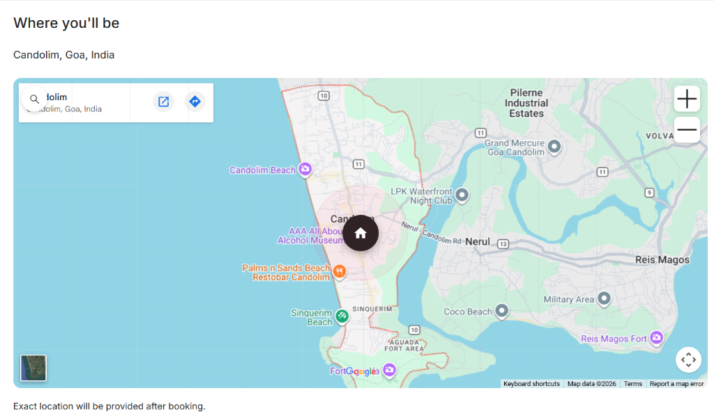

### Code Implementation

#### A. Interactive Map Embed & Controls (`MapSection.tsx`)
```tsx
// MapSection.tsx snippet
const MapSection = memo(function MapSection() {
  const [zoom, setZoom] = useState(14);
  const [neighbourhoodExpanded, setNeighbourhoodExpanded] = useState(false);

  const handleZoomIn = useCallback(() => {
    setZoom((z) => Math.min(z + 1, 18));
  }, []);

  const handleZoomOut = useCallback(() => {
    setZoom((z) => Math.max(z - 1, 10));
  }, []);

  const handleSearchClick = useCallback(() => {
    window.open("https://www.google.com/maps/search/?api=1&query=Candolim,+Goa,+India", "_blank");
  }, []);

  return (
    <section aria-labelledby="map-heading" className="_AIFnOW" id="location">
      {/* Real Google Maps embed inside the wrapper */}
      <div className="_qfDJVJ">
        <div className="_kYZPBQ">
          <iframe
            title="Interactive Google Map of Candolim, Goa"
            src={`https://maps.google.com/maps?q=Candolim,%20Goa,%20India&t=&z=${zoom}&ie=UTF8&iwloc=&output=embed`}
            width="100%"
            height="100%"
            style={{ border: 0 }}
          />
        </div>
        {/* controls overlays */}
      </div>
    </section>
  );
});
```

---

## 13. Business-Focused Site Footer

We styled and wired up a highly clean, structured **Business-Focused Site Footer** section containing multi-column resource listings, active internal portals, language/currency selector labels, and direct external social media anchors.

### Key Features
- **Structured Resource Organization**: Segmented into clear columns (Support, Hosting, Airbnb) with links to user guides, careers, policies, and neighborhood safety resources.
- **Dynamic Help Centre Shortcut**: Clicking the "Help Centre" link in the footer automatically opens the fullscreen **Help Centre overlay portal**, providing a seamless user support flow.
- **Polished Selectors & Socials**: Includes a localized globe selector button ("English (IN)"), a currency toggle widget ("₹ INR"), and custom svg-bound social links (Facebook, Twitter, Instagram).
- **Responsive Footer Grid**: Built with a clean column layout that stacks vertically on mobile screens and spreads out horizontally on tablet/desktop displays.

### Screenshot Demonstration
Below is a demonstration of the clean, business-focused footer layout:

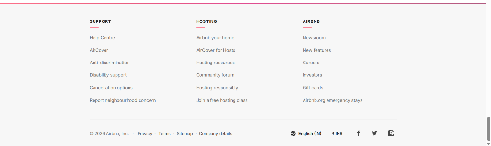

### Code Implementation

#### A. Interactive Footer Navigation & Links (`SiteFooter.tsx`)
```tsx
const FOOTER_URLS: Record<string, string> = {
  "Help Centre": "__help__",
  "AirCover": "https://www.airbnb.com/aircover",
  "Anti-discrimination": "https://www.airbnb.com/against-discrimination",
  "Disability support": "https://www.airbnb.com/accessibility",
  "Cancellation options": "https://www.airbnb.com/help/article/2701",
  "Report neighbourhood concern": "https://www.airbnb.com/neighbors",
  "Airbnb your home": "https://www.airbnb.com/host/homes",
  "AirCover for Hosts": "https://www.airbnb.com/aircover-for-hosts",
  "Hosting resources": "https://www.airbnb.com/resources",
  "Community forum": "https://community.withairbnb.com",
  "Hosting responsibly": "https://www.airbnb.com/help/responsible-hosting",
  "Join a free hosting class": "https://www.airbnb.com/ambassadors/joinaclass",
  "Newsroom": "https://news.airbnb.com",
  "New features": "https://www.airbnb.com/release",
  "Careers": "https://careers.airbnb.com",
  "Investors": "https://investors.airbnb.com",
  "Gift cards": "https://www.airbnb.com/giftcards",
  "Airbnb.org emergency stays": "https://www.airbnb.org",
};

const SiteFooter = memo(function SiteFooter() {
  const { showToast, setHelpOpen } = useApp();

  const handleFooterLink = useCallback((label: string, e: React.MouseEvent) => {
    e.preventDefault();
    const url = FOOTER_URLS[label];
    if (url === "__help__") {
      setHelpOpen(true);
    } else if (url) {
      window.open(url, "_blank", "noopener,noreferrer");
    } else {
      showToast(`${label}: Coming soon`);
    }
  }, [showToast, setHelpOpen]);

  // Render columns...
});
```
